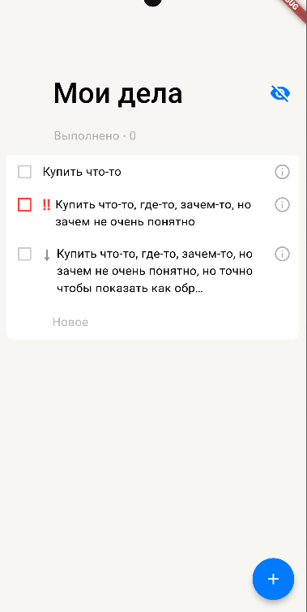
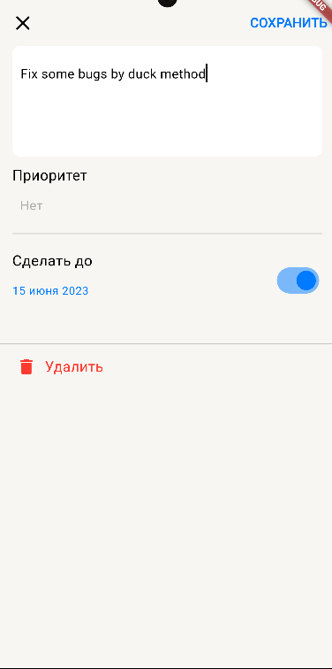

# ✅ ToDo Yandex
Домашнее задание 1 в Школе мобильной разработки | Flutter

## 📱 Скриншоты

 

## ♻️ Features
- Режим добавления/редактирования задачи
- Свайп по таску выполнено/удалить
- Показ/скрытие выполненных дел

## 📥 .apk файл для скачивания на Android

Вы можете скачать приложение по ссылке: [install To Do](https://github.com/o4irov/SHMR_ToDo/releases/download/1.0/app-release.apk)

## 📝 Библиотеки

- [intl: ^0.17.0](https://pub.dev/packages/intl)
- [logger: ^1.4.0](https://pub.dev/packages/logger)

## 👨‍💻 Авторы

- Очиров Андрей | [ваши вопросы по сотрудничеству](https://t.me/o41rov)
